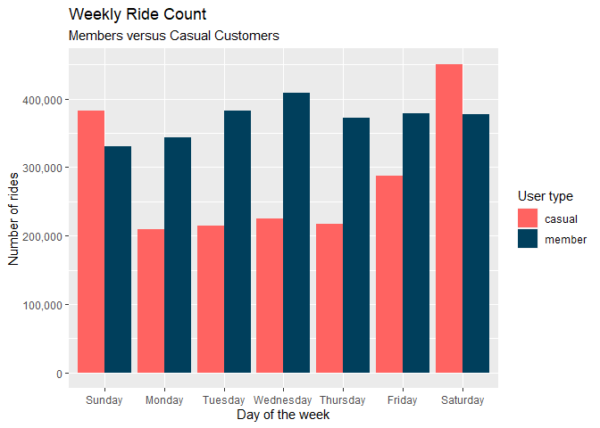
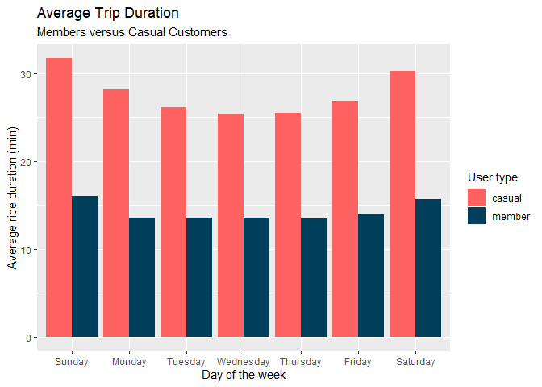

Cyclistic Bikeshare Case Study
================
Jason Cox
9/5/2021

## Scenario

You are a data analyst working in the marketing analyst team at
Cyclistic, a bike-share company in Chicago. The director of marketing
believes the company’s future success depends on maximizing the number
of annual memberships. Therefore, your team wants to understand how
casual riders and annual members use Cyclistic bikes differently. From
these insights, your team will design a new marketing strategy to
convert casual riders into annual members. But first, Cyclistic
executives must approve your recommendations, so they must be backed up
with compelling data insights and professional data visualizations.

## Step 1: Ask

-   How do annual members and casual users use Cyclistic bikes
    differently?
-   Why would casual riders buy annual memberships?

Our business task is to answer these questions and provide insights that
will inform Cyclistic’s marketing stategy to convert casual users to
subscribers.

## Step 2: Prepare

The data has been made available by Motivate International Inc. under
this license agreement:

<https://www.divvybikes.com/data-license-agreement>

The data is located here:
<https://divvy-tripdata.s3.amazonaws.com/index.html>.

Before we read in the data, we will load several libraries that will
assist us in this analysis.

We will be reading the months up to the most recent bikeshare data, July
2021.

    ## Warning in gzfile(file, mode): cannot open compressed file 'C:/Users/Jason/
    ## AppData/Local/Temp/Rtmpi6FZBA\file22247ca17e4a', probable reason 'No such
    ## file or directory'

Although this data is from the same site, we need to ensure the column
names are identical.

``` r
ident <- function(x,y) {
   for (i in names(x)) {
    if (!(i %in% names(y))) {
       print('Warning: Names are not identical.')
       break
     }
     else if(i==tail(names(y),n=1)) {
       print('Names are the same.')
     }
   }
 }

ident(m720,m820)
```

    ## [1] "Names are the same."

<!-- The remaining tests -->
<!-- ident(m720,m920) -->
<!-- ident(m720,m1020) -->
<!-- ident(m720,m1120) -->
<!-- ident(m720,m1220) -->
<!-- ident(m720,m121) -->
<!-- ident(m720,m221) -->
<!-- ident(m720,m321) -->
<!-- ident(m720,m421) -->
<!-- ident(m720,m521) -->
<!-- ident(m720,m621) -->
<!-- ident(m720,m721) -->

Since the columns appear to be the same, we will use the janitor library
to ensure the data types are identical.

``` r
compare_df_cols(m720,m820,m920,m1020,m1120,m1220,m121,m221,m321,m421, m521, m621, m721, return = 'mismatch')
```

    ##        column_name    m720    m820    m920   m1020   m1120     m1220
    ## 1   end_station_id numeric numeric numeric numeric numeric character
    ## 2 start_station_id numeric numeric numeric numeric numeric character
    ##        m121      m221      m321      m421      m521      m621      m721
    ## 1 character character character character character character character
    ## 2 character character character character character character character

The data frames prior to December 2020 have numeric elements. We will
ensure all of the id are character (string) types before merging the
months into one data frame.

``` r
m720 <- mutate(
            m720, 
            end_station_id = as.character(end_station_id),
            start_station_id = as.character(start_station_id))

m820 <- mutate(
  m820, 
  end_station_id = as.character(end_station_id),
  start_station_id = as.character(start_station_id))

m920 <- mutate(
  m920, 
  end_station_id = as.character(end_station_id),
  start_station_id = as.character(start_station_id))


m1020 <- mutate(
  m1020, 
  end_station_id = as.character(end_station_id),
  start_station_id = as.character(start_station_id))

m1120 <- mutate(
  m1120, 
  end_station_id = as.character(end_station_id),
  start_station_id = as.character(start_station_id))

# compare again 

compare_df_cols(m720,m820,m920,m1020,m1120,m1220,m121,m221,m321,m421, m521, m621, m721, return = 'mismatch')
```

    ##  [1] column_name m720        m820        m920        m1020      
    ##  [6] m1120       m1220       m121        m221        m321       
    ## [11] m421        m521        m621        m721       
    ## <0 rows> (or 0-length row.names)

No mismatches were found. It is now time to combine the months into one
data frame and look at the data summary

``` r
rides <- bind_rows(m720,m820,m920,m1020,m1120,m1220,m121,m221,m321,m421, m521, m621, m721)

summary(rides)
```

    ##    ride_id          rideable_type        started_at                 
    ##  Length:5189746     Length:5189746     Min.   :2020-07-01 00:00:14  
    ##  Class :character   Class :character   1st Qu.:2020-09-07 12:03:47  
    ##  Mode  :character   Mode  :character   Median :2021-02-07 23:39:07  
    ##                                        Mean   :2021-01-18 10:09:09  
    ##                                        3rd Qu.:2021-06-04 18:28:06  
    ##                                        Max.   :2021-06-30 23:59:59  
    ##                                                                     
    ##     ended_at                   start_station_name start_station_id  
    ##  Min.   :2020-07-01 00:03:01   Length:5189746     Length:5189746    
    ##  1st Qu.:2020-09-07 12:33:04   Class :character   Class :character  
    ##  Median :2021-02-08 05:30:32   Mode  :character   Mode  :character  
    ##  Mean   :2021-01-18 10:33:17                                        
    ##  3rd Qu.:2021-06-04 18:50:14                                        
    ##  Max.   :2021-07-13 22:51:35                                        
    ##                                                                     
    ##  end_station_name   end_station_id       start_lat       start_lng     
    ##  Length:5189746     Length:5189746     Min.   :41.64   Min.   :-87.87  
    ##  Class :character   Class :character   1st Qu.:41.88   1st Qu.:-87.66  
    ##  Mode  :character   Mode  :character   Median :41.90   Median :-87.64  
    ##                                        Mean   :41.90   Mean   :-87.64  
    ##                                        3rd Qu.:41.93   3rd Qu.:-87.63  
    ##                                        Max.   :42.08   Max.   :-87.52  
    ##                                                                        
    ##     end_lat         end_lng       member_casual     
    ##  Min.   :41.51   Min.   :-88.07   Length:5189746    
    ##  1st Qu.:41.88   1st Qu.:-87.66   Class :character  
    ##  Median :41.90   Median :-87.64   Mode  :character  
    ##  Mean   :41.90   Mean   :-87.64                     
    ##  3rd Qu.:41.93   3rd Qu.:-87.63                     
    ##  Max.   :42.16   Max.   :-87.44                     
    ##  NA's   :6003    NA's   :6003

## Step 3: Process

In order to begin cleaning the data, let’s ensure the categorical
variables that are intended to be in the data frame are the only ones
showing up in the rows. There should be 3 ride types and two categories
for user type. Let’s also rename rideable\_type to ride\_type.

``` r
unique(rides$rideable_type) 
```

    ## [1] "docked_bike"   "electric_bike" "classic_bike"

``` r
unique(rides$member_casual) 
```

    ## [1] "member" "casual"

``` r
rides <- rides %>% rename(ride_type = rideable_type)
```

The summary in Step 2 shows some missing values, especially in end\_lat
and end\_lng. Let’s assess the total of missing values in the data frame
and calculate the percentage of missing values by column name.

``` r
sum(is.na(rides))
```

    ## [1] 1540407

``` r
ncol <- ncol(rides)
for (i in 1:ncol) {
  percentage = mean(is.na(rides[i])) * 100
  
  print(paste0('percentage of missing values for ',colnames(rides[i])))
  print(percentage)
  cat("\n")
}
```

    ## [1] "percentage of missing values for ride_id"
    ## [1] 0
    ## 
    ## [1] "percentage of missing values for ride_type"
    ## [1] 0
    ## 
    ## [1] "percentage of missing values for started_at"
    ## [1] 0
    ## 
    ## [1] "percentage of missing values for ended_at"
    ## [1] 0
    ## 
    ## [1] "percentage of missing values for start_station_name"
    ## [1] 6.978395
    ## 
    ## [1] "percentage of missing values for start_station_id"
    ## [1] 6.990458
    ## 
    ## [1] "percentage of missing values for end_station_name"
    ## [1] 7.736332
    ## 
    ## [1] "percentage of missing values for end_station_id"
    ## [1] 7.745215
    ## 
    ## [1] "percentage of missing values for start_lat"
    ## [1] 0
    ## 
    ## [1] "percentage of missing values for start_lng"
    ## [1] 0
    ## 
    ## [1] "percentage of missing values for end_lat"
    ## [1] 0.1156704
    ## 
    ## [1] "percentage of missing values for end_lng"
    ## [1] 0.1156704
    ## 
    ## [1] "percentage of missing values for member_casual"
    ## [1] 0

Let’s remove rows with missing data to further clean the data set.

``` r
rides_clean <- rides[complete.cases(rides), ]

nrow(rides) - nrow(rides_clean) # Total rows removed 
```

    ## [1] 555465

Add date, month, day, year, and day of week to aggregate ride data and
for use in Tableau

``` r
rides_clean$date <- as.Date(rides_clean$started_at) 
rides_clean$month <- format(as.Date(rides_clean$date), "%m")
rides_clean$day <- format(as.Date(rides_clean$date), "%d")
rides_clean$year <- format(as.Date(rides_clean$date), "%Y")
rides_clean$day_of_week <- format(as.Date(rides_clean$date), "%A")
```

We need a trip duration column, the difference between ride end time and
start time. We will include a trip duration in minutes as well since the
unit ‘seconds’ can be difficult to interpret.

``` r
rides_clean$trip_duration <- rides_clean$ended_at - rides_clean$started_at # in seconds
rides_clean$trip_duration_min <- as.numeric(rides_clean$trip_duration, units = "mins")
```

We’ll keep only positive trip duration

``` r
rides_clean <- rides_clean %>% 
  filter(rides_clean$trip_duration >= 0)
```

Removing 99th percentile outliers, as some trips were unreasonably long.
The max was 55,000 minutes!

``` r
rides_clean2 <- rides_clean %>% 
  filter(trip_duration <= quantile(trip_duration, .99))
```

## Step 4: Analyze

It is now time to analyze the data using descriptive statistics.

``` r
summary(rides_clean2$trip_duration_min) # Five number summary, including Max, Min, Mean, Median
```

    ##    Min. 1st Qu.  Median    Mean 3rd Qu.    Max. 
    ##   0.000   7.667  13.700  20.309  24.850 150.600

``` r
Mode(rides_clean2$day_of_week) 
```

    ## [1] "Saturday"
    ## attr(,"freq")
    ## [1] 828377

``` r
# average ride time by each day for members vs casual users
rides_clean2 %>% 
 group_by(member_casual) %>% 
  summarize(mean(trip_duration_min))
```

    ## # A tibble: 2 x 2
    ##   member_casual `mean(trip_duration_min)`
    ##   <chr>                             <dbl>
    ## 1 casual                             28.3
    ## 2 member                             14.2

``` r
unique(rides_clean2$day_of_week)
```

    ## [1] "Thursday"  "Friday"    "Wednesday" "Saturday"  "Tuesday"   "Monday"   
    ## [7] "Sunday"

``` r
# The days of the week are out of order
rides_clean2$day_of_week <- ordered(rides_clean2$day_of_week, levels=c("Sunday", "Monday", "Tuesday", "Wednesday", "Thursday", "Friday", "Saturday"))

# average trip_duration for users by day_of_week
rides_clean2 %>% 
  group_by(day_of_week) %>% 
  summarize(mean(trip_duration_min))
```

    ## # A tibble: 7 x 2
    ##   day_of_week `mean(trip_duration_min)`
    ##   <ord>                           <dbl>
    ## 1 Sunday                           24.4
    ## 2 Monday                           19.1
    ## 3 Tuesday                          18.0
    ## 4 Wednesday                        17.7
    ## 5 Thursday                         17.9
    ## 6 Friday                           19.5
    ## 7 Saturday                         23.6

``` r
# See the average ride time by each day for members vs casual users

aggregate(rides_clean2$trip_duration_min ~ rides_clean2$member_casual + rides_clean2$day_of_week, FUN = mean)
```

    ##    rides_clean2$member_casual rides_clean2$day_of_week
    ## 1                      casual                   Sunday
    ## 2                      member                   Sunday
    ## 3                      casual                   Monday
    ## 4                      member                   Monday
    ## 5                      casual                  Tuesday
    ## 6                      member                  Tuesday
    ## 7                      casual                Wednesday
    ## 8                      member                Wednesday
    ## 9                      casual                 Thursday
    ## 10                     member                 Thursday
    ## 11                     casual                   Friday
    ## 12                     member                   Friday
    ## 13                     casual                 Saturday
    ## 14                     member                 Saturday
    ##    rides_clean2$trip_duration_min
    ## 1                        31.72777
    ## 2                        15.98019
    ## 3                        28.10819
    ## 4                        13.56630
    ## 5                        26.09002
    ## 6                        13.53825
    ## 7                        25.34518
    ## 8                        13.54252
    ## 9                        25.42997
    ## 10                       13.49305
    ## 11                       26.84184
    ## 12                       13.89301
    ## 13                       30.22003
    ## 14                       15.63722

``` r
# Now, let's run the average ride time by each day for members vs casual users

rides_clean2 %>% 
  group_by(member_casual, day_of_week) %>%  
  summarise(number_of_rides = n()                   
            ,average_duration = mean(trip_duration_min)) %>%    
  arrange(member_casual, day_of_week)   
```

    ## # A tibble: 14 x 4
    ## # Groups:   member_casual [2]
    ##    member_casual day_of_week number_of_rides average_duration
    ##    <chr>         <ord>                 <int>            <dbl>
    ##  1 casual        Sunday               382006             31.7
    ##  2 casual        Monday               209561             28.1
    ##  3 casual        Tuesday              214146             26.1
    ##  4 casual        Wednesday            225136             25.3
    ##  5 casual        Thursday             216893             25.4
    ##  6 casual        Friday               287548             26.8
    ##  7 casual        Saturday             450594             30.2
    ##  8 member        Sunday               329906             16.0
    ##  9 member        Monday               343054             13.6
    ## 10 member        Tuesday              382130             13.5
    ## 11 member        Wednesday            408992             13.5
    ## 12 member        Thursday             371864             13.5
    ## 13 member        Friday               378647             13.9
    ## 14 member        Saturday             377783             15.6

Findings:

-   Saturday is the day of the week with the most number of rides
    (e.g. mode of day\_of\_week)
-   Casual users take longer trips than members on average
-   Members use the bike uniformly during the week, while casual users
    tend to have most of their use on weekends

## Step 5: Share

``` r
# visualize number of rides by rider type
rides_clean2 %>% 
  group_by(member_casual, day_of_week) %>% 
  summarize(number_of_rides = n(),
            average_duration = mean(trip_duration_min)) %>% 
  arrange(member_casual, day_of_week) %>% 
  ggplot(aes(x = day_of_week, y = number_of_rides, fill = member_casual)) +
  geom_col(position = "dodge") +
  scale_fill_manual(values = c("#ff6361","#003f5c")) +
  scale_y_continuous(labels = scales::comma) +
  labs(title = "Weekly Ride Count",
       subtitle = "Members versus Casual Customers", fill = "User type") +
  ylab("Number of rides") +
  xlab("Day of the week")
```

<!-- -->

``` r
# visualization for average duration
rides_clean2 %>% 
  group_by(member_casual, day_of_week) %>% 
  summarize(average_duration = mean(trip_duration_min)) %>% 
  arrange(member_casual, day_of_week) %>% 
  ggplot(aes(x = day_of_week, y = average_duration, fill = member_casual)) +
  geom_col(position = "dodge") +
  scale_fill_manual(values = c("#ff6361","#003f5c")) +
  labs(title = "Average Trip Duration",
       subtitle = "Members versus Casual Customers", fill = "User type") +
  ylab("Average ride duration (min)") +
  xlab("Day of the week")
```

<!-- -->

``` r
# # Let's visualize the number of rides by rider type
# rides_clean2 %>% 
#   group_by(member_casual, day_of_week) %>% 
#   summarise(number_of_rides = n()
#             ) %>% 
#   arrange(member_casual, day_of_week)  %>% 
#   ggplot(aes(x = day_of_week, y = number_of_rides, fill = member_casual)) +
#   geom_col(position = "dodge")
# 
# # Let's create a visualization for average duration
# rides_clean2 %>% 
#   group_by(member_casual, day_of_week) %>% 
#   summarise(average_duration = mean(trip_duration_min)) %>% 
#   arrange(member_casual, day_of_week)  %>% 
#   ggplot(aes(x = day_of_week, y = average_duration, fill = member_casual)) +
#   geom_col(position = "dodge")
```

## Step 6: Act

### Top 3 Recommendations <br>

-   Since casual members take longer trips than subscribers, we can put
    together a marketing campaign that highlights convenient, short
    trips anywhere, anytime.

-   Since casual members tend to be using stations concentrated in the
    tourist areas (e.g. Downtown, Navy Pier, Lincoln Park Zoo), we can
    target residential neighborhoods outside of downtown as well.

-   Casual members primarily ride on the weekends. It would make sense
    for us to target commuters and people who work remotely or in
    co-working spaces. The primary message here would be that it is easy
    to grab a bike for a short lunch trip or a quick commute, rather
    than wait for a train or pay for a ride share service.
